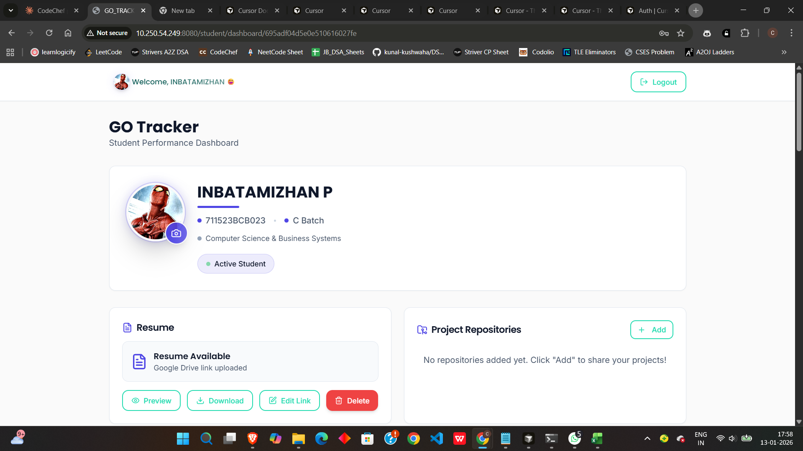

## GO Tracker – Project Documentation

### 1) Overview
- Student performance dashboard aggregating coding progress across LeetCode, CodeChef, Codeforces, GitHub, and Codolio.
- Stack: React 18 + Vite + Tailwind + Shadcn/ui (frontend), Node.js + Express + MongoDB + JWT (backend), Python scrapers (requests/BeautifulSoup/Selenium, plus platform APIs).
- Roles: Student, Staff, Admin/Owner with tailored dashboards.

### 2) Key Features
- Multi-platform stats (ratings, problems solved, contests, repos, streaks, badges).
- Real-time/automated scraping with retries, rate limits, and logging.
- Weekly analytics: heatmaps, charts, comparisons.
- Resume links and project repositories per student.
- Admin monitoring: logs, system health, manual scrape triggers.

### 3) Architecture (text diagram)
```
Platforms (APIs + Web) → Python Scrapers → MongoDB
MongoDB ↔ Express API (Node) → React Frontend
Scheduler → Scrapers (staggered jobs)
```

### 4) Quick Start (local)
1) Prereqs: Node 18+, Python 3.8+, MongoDB 5+, Chrome.  
2) Backend  
   - `cd backend && npm install`  
   - Copy `.env.example` to `.env` and fill values (`PORT=5000`, `MONGO_URI=...`, `JWT_SECRET=...`, `FRONTEND_URL=http://localhost:5173`).  
   - `npm run dev`
3) Frontend  
   - From repo root: `npm install`  
   - Create `.env` with `VITE_API_URL=http://localhost:5000/api`  
   - `npm run dev`
4) Scraper  
   - `cd scraper && pip install -r requirements.txt`  
   - For Selenium, ensure Chrome + ChromeDriver (or webdriver-manager).  
5) Access  
   - Frontend: http://localhost:5173  
   - API health: http://localhost:5000/health

### 5) Running Scrapers
- All students: `python scrape_all_students.py`
- Per platform: `python platform_scrapers.py`
- Codolio (Selenium): `python scrape_codolio.py`
- GitHub streaks: `python fetch_streaks_batch.py`
- Schedule (example cron): `0 2 * * * cd /path/to/scraper && python scrape_all_students.py`

### 6) Deployment Notes
- Set production `.env` (API, Mongo, JWT, CORS).  
- Optionally use `docker-compose up -d` from repo root.  
- Backend Dockerfile example already present (Node 18 alpine).  
- Ensure `FRONTEND_URL` and `VITE_API_URL` point to production domains.

### 7) API (high level)
- `GET /api/students` – list students
- `GET /api/students/:id` – student detail
- `GET /api/admin/dashboard` – overview metrics
- `GET /api/admin/logs` – scraper logs
- `GET /api/admin/stats` – system stats
- `POST /api/scrape/:platform` – trigger scrape (if enabled)

### 8) Credentials (sample defaults; adjust in your env)
- Student: name or roll as username; password = roll (see `LOGIN_CREDENTIALS.md` for full list)
- Staff: `staff@college.edu / staff123`
- Admin: `admin@college.edu / admin123` or owner credentials in README

### 9) Troubleshooting Cheatsheet
- Mongo down: start service (`mongod` or OS service).  
- Ports busy: free 5000/5173 (use `npx kill-port <port>`).  
- CORS errors: match `FRONTEND_URL` with running frontend URL.  
- Selenium issues: update Chrome + ChromeDriver (`pip install --upgrade webdriver-manager`).  
- Missing deps: reinstall `npm install` and `pip install -r requirements.txt`.

### 10) Suggested Screenshots / Images
- `docs/images/login.png` – Login page (role selection).
- `docs/images/student-dashboard.png` – Student dashboard overview.
- `docs/images/admin-dashboard.png` – Admin dashboard cards + logs.
- `docs/images/platform-cards.png` – LeetCode/CodeChef/Codeforces/GitHub/Codolio cards.
- `docs/images/charts.png` – Weekly progress line + pie comparisons.
- `docs/images/heatmap.png` – Contributions/contest heatmap.
- `docs/images/architecture.png` – System architecture diagram (frontend/api/scraper/db).

### 11) How to Embed Images (after you add them)
```



```

### 12) Repo Structure (short)
```
backend/   # Express API, Mongo models/routes
src/       # React app (components, pages, services)
scraper/   # Python scrapers + scheduler
public/    # Static assets
docs/images/ # Put your screenshots here (create folder)
```

### 13) Notes for Reviewers
- Data shown is live-scraped; ensure environment variables and tokens (GitHub) are configured.
- Scheduler staggered to respect platform rate limits.
- Heatmaps/charts rely on scraped history; run a full scrape for fresh visuals.

